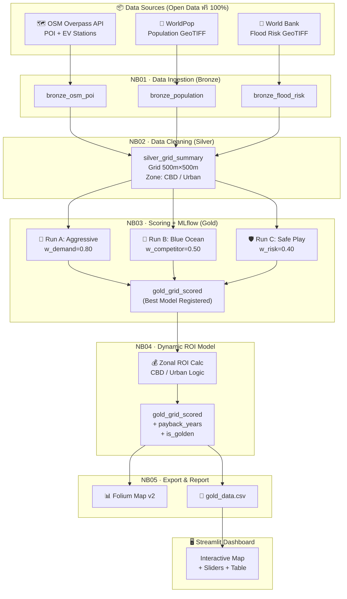

# ⚡ Smart EV Site Selection

> **ระบบจำลองกลยุทธ์และคัดกรองทำเลสถานีชาร์จ EV อัจฉริยะ**  
> ลดความเสี่ยงให้นักลงทุนด้วย Data แทนการคาดเดา


---

[](https://huggingface.co/spaces/DuckerMaster/EV_Site_Optimizer)

---

## 📌 Overview 

ตลาด EV ไทยเติบโตกว่า **300%** ในช่วงปี 2022–2024 แต่สถานีชาร์จสาธารณะ 11,467 จุดทั่วประเทศ (ธ.ค. 2024) ยังกระจุกตัวอยู่ในเมืองหลัก ขณะที่พื้นที่ Demand สูงแต่สถานีน้อยคือ **โอกาสทางธุรกิจที่แท้จริง**

ปัญหาคือต้นทุนติดตั้ง Fast Charger อยู่ที่ **800,000–2,000,000 บาทต่อจุด** — การเลือกทำเลผิดคือความเสี่ยงสูงที่สุดของนักลงทุน

โปรเจคนี้จึงถูกสร้างขึ้นเพื่อตอบคำถามเดียว:

> _"ควรติดตั้งที่ไหน เพื่อให้คืนทุนได้เร็วที่สุดและเสี่ยงน้อยที่สุด?"_

---

## 🎯 Objectives & Scope
คัดกรองทำเล "Golden Gap" (Demand สูง คู่แข่งน้อย ปลอดภัยจากน้ำท่วม)
โดยจำลอง 3 กลยุทธ์การลงทุนผ่าน MLflow และคำนวณ ROI แยกตาม Zone

**พื้นที่ Pilot:** กทม. 50 เขต + ปริมณฑล · 2,237 Grid Cells (500m×500m)
**ขยายได้:** เปลี่ยน BBOX เพียงอย่างเดียวเพื่อครอบคลุมจังหวัดใหม่

---

## 🏗️ Pipeline Overview



---

## 📡 แหล่งข้อมูล (Data Sources)

ทุกแหล่งข้อมูลเป็น **Open Data ฟรี 100%** ไม่มีค่าใช้จ่าย ไม่ต้องผูกบัตรเครดิต

| มิติ | แหล่งข้อมูล | วิธีดึง | เหตุผลที่เลือก |
|------|------------|---------|---------------|
| **Demand** | OSM Overpass API | POST API | นับ POI (ห้าง, ออฟฟิศ, โรงแรม, ปั๊ม) ต่อ Grid — วัดว่าพื้นที่นั้นมีคนใช้รถมากแค่ไหน |
| **Supply (EV)** | OSM `amenity=charging_station` | POST API (เดิม) | หา Market Gap — พื้นที่ที่ Demand สูงแต่ EV Station ยังน้อย |
| **Population** | WorldPop Grid (worldpop.org) | Download GeoTIFF | วัด Population Density ต่อ Grid เพื่อยืนยัน Demand จาก POI ด้วยจำนวนคนจริง |
| **Flood Risk** | World Bank Data Catalog | Download GeoTIFF | ตรวจสอบระดับน้ำท่วมต่อ Grid — ป้องกันการลงทุนในพื้นที่เสี่ยง ซึ่ง OSM และ WorldPop ไม่มีข้อมูลนี้ |
| **Economics** | Zone Logic (Lat/Lon → ระยะจากศูนย์ กทม.) | คำนวณในโค้ด | แยก OpEx CBD (×1.2) และ Revenue Growth Urban (5%/ปี) โดยไม่ต้องพึ่งข้อมูลราคาเช่าจริงที่ไม่มีให้ฟรี |
| **Business Context** | EVAT, DLT, IEA, Roland Berger | Download / เว็บไซต์ | ใช้อ้างอิง Business Assumption และตรวจสอบความสมเหตุสมผลของ Model |

> **หมายเหตุ:** Revenue/Usage Data เป็น Simulation จาก `demand_score_norm` เนื่องจาก Private data ของ Operator ไม่สามารถเข้าถึงได้ — ระบุ Assumption ชัดเจนในทุก Notebook

---

## ✨ ฟีเจอร์หลัก

- **🎯 Golden Gap Detection** — คัดกรองพื้นที่ที่ Demand สูง คู่แข่งน้อย และปลอดภัยจากน้ำท่วม ใน 2,237 Grid Cells ครอบคลุม กทม. + ปริมณฑล
- **🤖 3 กลยุทธ์การลงทุน via MLflow** — Aggressive / Blue Ocean / Safe Play เปรียบเทียบผลได้ทันที พร้อม Model Registry
- **💰 Dynamic ROI Model** — คำนวณ Payback Period แยกตาม Zone (CBD/Urban) พร้อม Sensitivity Analysis
- **🗺️ Interactive Dashboard** — ปรับ Slider แบบ Real-time แผนที่ Folium อัปเดตทันที

---

## 🛠️ Tech Stack

| เครื่องมือ | บทบาท  |
|-----------|-------|
| Databricks Community Edition | Compute + Notebook Runner |
| PySpark | Distributed Processing + Geospatial UDF |
| MLflow 3.8.1 | Experiment Tracking + Model Registry |
| Delta Lake | Medallion Architecture (Bronze/Silver/Gold) | 
| Folium | Map Visualization | 
| Streamlit | Interactive Dashboard |
| Hugging Face Space | Deploy Dashboard |

## 🖥️ Live Demo

[](https://huggingface.co/spaces/DuckerMaster/EV_Site_Optimizer)


---

## 📁 โครงสร้างโปรเจค

```
Smart-Ev-Site-Selection/
├── notebooks/
│   ├── 01_data_ingestion.ipynb     ← Bronze: OSM + WorldPop + Flood
│   ├── 02_data_cleaning.ipynb      ← Silver: Grid 500m + Zoning
│   ├── 03_scoring_mlflow.ipynb     ← Gold: 3 Scenarios + MLflow
│   ├── 04_Dynamic_ROI_Model.ipynb  ← ROI + Payback + flood_safe flag
│   └── 05_Export_Final_Report.ipynb← Folium Map + Export CSV
├── app.py                          ← Streamlit Dashboard
├── gold_data.csv                   ← Output จาก NB05
├── requirements.txt
└── README.md
```

---

## 📐 Scoring Formula

```
Total Score = (Demand Score × w_demand)
            - (ev_station   × w_competitor)
            - (flood_risk   × w_risk)

Demand Score = ห้าง×w_mall + ออฟฟิศ×w_office + โรงแรม×w_hotel
             + ที่จอด×w_parking + ปั๊ม×w_fuel  → Normalize 0–1

Gap Score = demand_score_norm × (1 / (ev_station + 1))
```

| Scenario | w_demand | w_competitor | w_risk | กลยุทธ์ |
|----------|---------|-------------|--------|---------|
| A: Aggressive | 0.80 | 0.10 | 0.10 | เน้นพื้นที่คนใช้เยอะ |
| B: Blue Ocean | 0.40 | 0.50 | 0.10 | เน้นตลาดที่ยังไม่มีคู่แข่ง |
| C: Safe Play  | 0.40 | 0.20 | 0.40 | เน้นความปลอดภัย ความเสี่ยงต่ำ |

---

## 🎯 ขอบเขตโครงการ

- **พื้นที่ Pilot:** กรุงเทพมหานคร (50 เขต) + นนทบุรี, ปทุมธานี, สมุทรปราการ, สมุทรสาคร
- **Grid System:** 500m × 500m → 2,237 Grid Cells ที่มีข้อมูล POI
- **Zone:** CBD (ระยะ < 10 กม. จากศูนย์ กทม.) / Urban Fringe (≥ 10 กม.)
- **ขยายได้:** เปลี่ยน BBOX เพียงอย่างเดียวเพื่อครอบคลุมจังหวัดใหม่

---

## 📝 License

MIT License — ใช้ได้ฟรี ทำซ้ำได้ อ้างอิงได้
